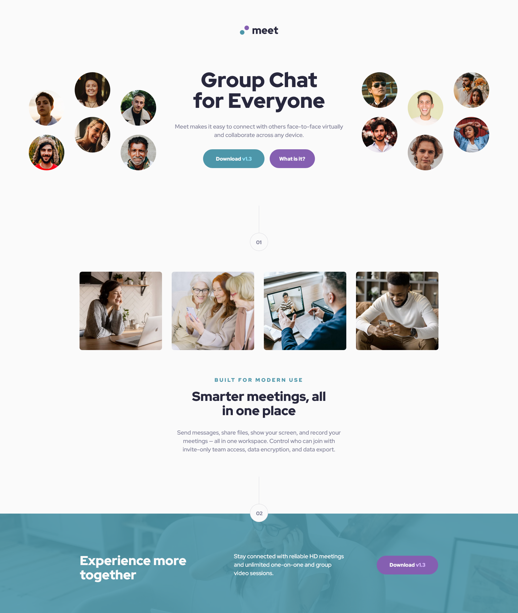

# Frontend Mentor - Meet landing page solution

This is a solution to the [Meet landing page challenge on Frontend Mentor](https://www.frontendmentor.io/challenges/meet-landing-page-rbTDS6OUR). Frontend Mentor challenges help you improve your coding skills by building realistic projects. 

## Table of contents

- [Overview](#overview)
  - [The challenge](#the-challenge)
  - [Screenshot](#screenshot)
  - [Links](#links)
- [My process](#my-process)
  - [Built with](#built-with)
  - [What I learned](#what-i-learned)
  - [Continued development](#continued-development)
  - [Useful resources](#useful-resources)
- [Author](#author)

**Note: Delete this note and update the table of contents based on what sections you keep.**

## Overview

### The challenge

Users should be able to:

- View the optimal layout depending on their device's screen size
- See hover states for interactive elements

### Screenshot

### Links

- Solution URL: [https://www.frontendmentor.io/solutions/responsive-meet-landing-page-5IhwhOHHVy](https://www.frontendmentor.io/solutions/responsive-meet-landing-page-5IhwhOHHVy)
- Live Site URL: [https://carstenkoerner.github.io/meet-landing-page/](https://carstenkoerner.github.io/meet-landing-page/)

## My process

### Built with

- Semantic HTML5 markup
- CSS custom properties
- Flexbox
- CSS Grid
- Mobile-first workflow

### What I learned

I learned: 
- to use grid and flex in the same project
- to apply a colour effect to a background image
- to use the Lunacy app to work with Sketch files

### Continued development

To work with Sketch Files is a big plus for getting my projects more exactly to the template. I will continue to do so.

### Useful resources

- [https://icons8.de/lunacy](https://icons8.de/lunacy) - This native app is really cool and for free.

## Author

- Frontend Mentor - [@carstenkoerner](https://www.frontendmentor.io/profile/carstenkoerner)
